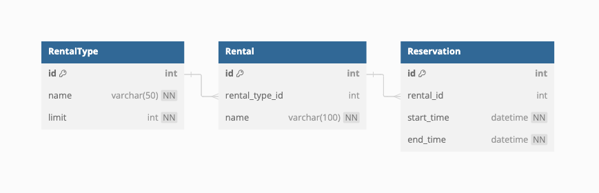

# Design

## Data Models

This implementation uses three data models to deliver the core functionality:

**RentalType:**    
    `RentalType` represents the different vacation home types of a `Rental` that are available. 

**Rental**
    A `Rental` is a vacation home that is available to rent under a `Reservation`. 

**Reservation**
    A `Reservation` represents a `Rental` that has been booked with a given start and end time. 

Below is DBML diagram that outlines the relationships. Note there is no user data; for the sake of keeping this project scoped to the core functionality any user-related information has been purposefully omitted. 
<p align="center">
  
</p>

## API Endpoints

##### `rentals/reservation`

**Method:** POST

**Description:** Create a reservation. Upon creation the reservation is validated to ensure there are no existing reservations that overlap.

**Payload:** (example)
```json
{
  "rental": 1,
  "start_time": "2024-07-15T10:00:00",
  "end_time": "2024-07-20T10:00:00"
}
```

***

##### `/rentals/reservation`
**Method:** GET

**Description:** Retrieve all reservations with optional query parameters for filtering. `start_time` and `end_time` can provide a useful date range to look for existing reservations.

**Optional Query Parameters:**
* `rental`: Filter reservations by rental ID
* `start_time`: Filter reservations starting at or after this time
* `end_time`: Filter reservations ending at or before this time

***

##### `/rentals/listings`

**Method:** GET

**Description:** Retrieve all rentals with optional query parameters for filtering.

**Optional Query Parameters:**
- `rental_type`: Filter by rental type ID.
- `name`: Filter by rental name (contains-lookup).
***

## Thought Process

Given that this is a coding assignment, I've put down some of my own assumptions and considerations of this implementation that I took notes of along the way.

**Assumptions:**
- User info is not relevant to core features - if it is relevant, the design is extensible enough to easily integrate user logic. 
- Creating a reservation requires a *specific* rental property to be given. In a real world application based off this API the flow would involve grabbing *all* rentals (using `/rentals/listings`) and then passing a specific `Rental` id in the payload to `/rentals/reservation`. 
- The # of rentals allowed per rental type is dynamic. I considered making this an in-memory value to avoid DB lookup on each new rental creation, however this value seems like it will scale with the growth of the data and mitigates the need to re-deploy upon changing.


**Considerations:**
- [Django conveniently takes care of timezone conversions](https://docs.djangoproject.com/en/5.0/topics/i18n/timezones/) to UTC in the database. Additionally, through the use of `django-filter`, reading timestamps in non-utc time from the client is taken care of for us. This declutters the business logic implementation by avoiding manual tz conversion. 
- Determining rental availability can become inefficient as the database grows. Can potentially index on start/end times or precompute availability when a new reservation is made and cache newly-calculated availability (especially if a particular reservation is popular)
- As more rentals and reservations are added, the API response size can grow large, especially when no query params are used to filter. Paginating API results would be a good idea as the data grows.